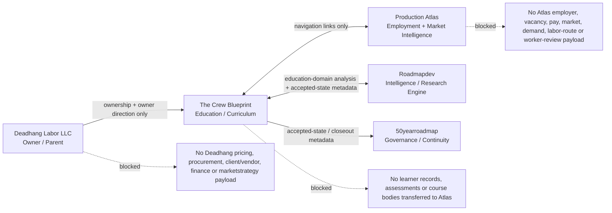

# Crew Blueprint ecosystem boundary map

This is the human-readable companion to `relationship-map.json`.

## What each edge means

### Deadhang Labor LLC → Crew Blueprint

Deadhang owns the product and can direct product/governance decisions. Ownership does **not** create a commercial-data feed. Deadhang pricing, margins, procurement, client/vendor information, insurance strategy, sourcing, market strategy and other private operating intelligence stay outside Crew Blueprint curriculum and learner-facing systems.

### Crew Blueprint ↔ Production Atlas

The products link to each other so a learner can move between **Learn** and **Work**. The link carries only stable URLs/route identifiers and a bounded purpose label.

Production Atlas employment intelligence is not curriculum evidence. Crew Blueprint learner state/content is not Atlas data.

### Crew Blueprint ↔ Roadmapdev

Roadmapdev can analyze the wider ecosystem, but Crew Blueprint may admit only explicitly educational/curriculum research that has been separated from Deadhang commercial and Atlas employment-intelligence payloads.

### Crew Blueprint → 50yearroadmap

Crew Blueprint reports accepted-state, provenance and closeout metadata into the governance/continuity plane. This does not transfer canonical curriculum ownership.

## Curriculum evidence boundary

Learner-facing claims belong to the education domain and must stand on admissible sources such as applicable OSHA/regulatory material, official agency guidance, recognized consensus standards within copyright limits, manufacturer documentation, legitimate technical/educational sources, credential-body guidance and clearly labeled practitioner knowledge where appropriate.

Market demand can motivate a **private question** such as “should we research this competency more deeply?” It does not become the evidence used to teach the learner.
